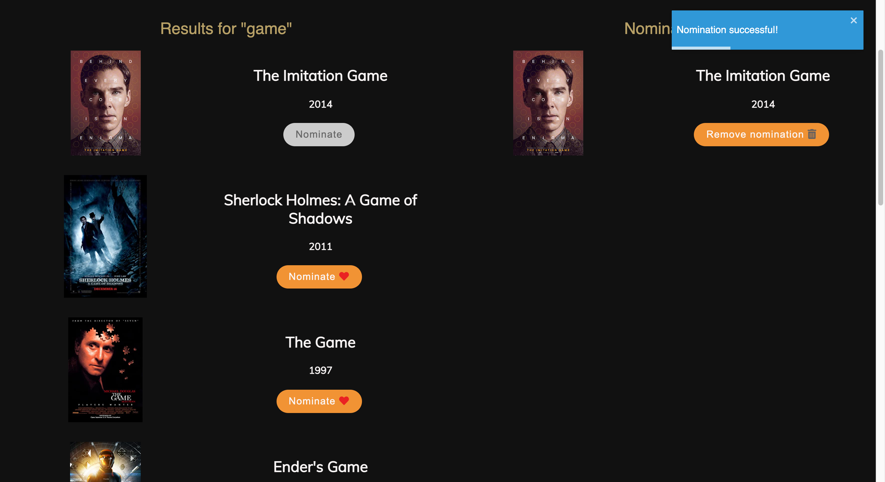
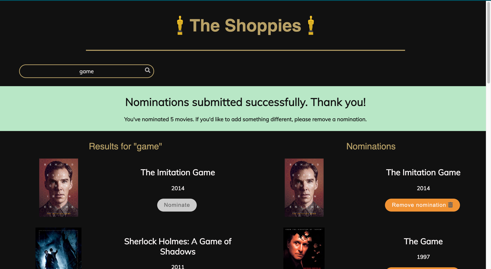

# Shoppies Movie Awards

<b>[This website is live on Netlify!](https://shoppies-movie-awards.netlify.app/)</b>

Built for the 2021 Summer internship at Shopify, this app allows users to search
for and nominate 5 of their favorite movies. The app searches
[OMDB API](http://www.omdbapi.com/) for movies and manages nominations so
Shopify can host its own movie awards, the Shoppies!

## Table of Contents

- [Tech Stack](#tech-stack)
- [Screenshots](#screenshots)
- [Dependencies](#dependencies)
- [Project Setup](#project-setup)

## Tech Stack

- React
- CSS
- Deployment: Netlify

## Screenshots

 

## Dependencies

- Create React App
- React DOM
- React Toastify

## Project Setup

1. Fork this project
2. Clone the forked project to a local directory
3. CD into that directory
4. `npm install` to get all project dependencies
5. `npm start` to run project
